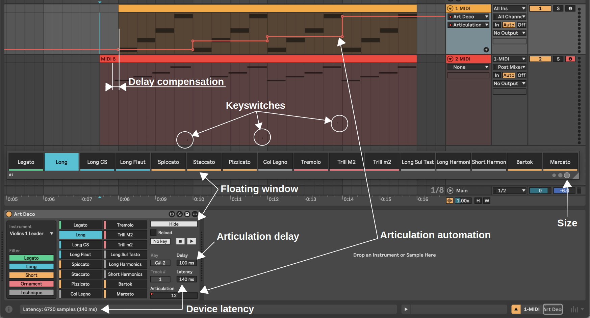

# Art Deco [WIP]

> Articulation delay compensation, a [Max for Live](https://www.ableton.com/en/live/max-for-live/) device for sampled instruments articulation keyswitch automation and delay compensation


## Usage

1. Configuration
   - Customize the articulation list by modifying [articulations.tsv](./articulations.tsv).
   - The `.TSV` (Tab Separated Values) format can be copied/pasted to and edited in Google Sheets, for example.
   - Keep this file alongside your `.amxd` device file (same folder or one level up).
   - Note: The current data is set up for BBC Symphony Orchestra users, sourced from [this spreadsheet](https://docs.google.com/spreadsheets/d/1WP9sobba7OkldNkTiSzXP7r3Pb64IzWQWrLkqdiyRcA/preview#gid=0).
2. Tip: Assign a hotkey to the `Show` button on the first track to quickly access articulation selection for the currently selected track.
3. Use `No key` to disable keyswitch sending.
4. `Play/Stop` buttons bypass delay compensation for real-time performance.
5. Filter articulations by category (`Legato`, `Long`, `Short`, `Ornament`, `Technique`) to streamline selection in articulation-per-track setups.
6. Override delay compensation temporarily in the `Delay` field for fine-tuning. Edit `articulations.tsv` to make changes permanent.
7. GUI overview


## Development

### Prerequisites

- configure [maxdiff](https://github.com/Ableton/maxdevtools/tree/main/maxdiff)

### Diff

```bash
git --no-pager diff "./Art Deco.amxd"
```

### Frozen testing

Save device in gitignored `./frozen/` folder, it will read the articulations.tsv file from folder above automatically.

### Summary

Print articulation summary by category, for categorisation check. 

```bash
deno --allow-read summary.js
```
