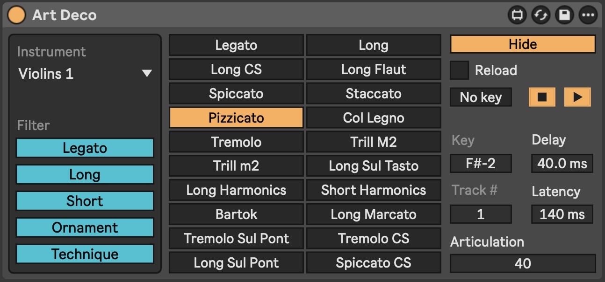
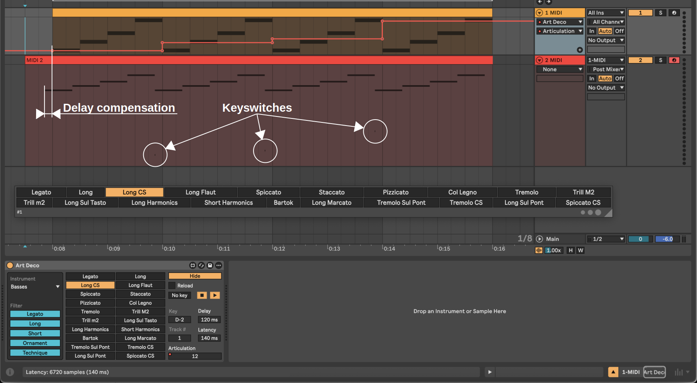

# Art Deco [WIP]

> Articulation delay compensation, a [Max for Live](https://www.ableton.com/en/live/max-for-live/) device for sampled instruments articulation keyswitch automation and delay compensation

__Device__ 
__Floating window__ 

## Usage

1. Adjust [articulations.tsv](./articulations.tsv), this file should be in same (or above) folder as the amxd device.
2. GUI overview



## Development

### Prerequisites

- configure [maxdiff](https://github.com/Ableton/maxdevtools/tree/main/maxdiff)

### Diff

```bash
git --no-pager diff "./Art Deco.amxd"
```
