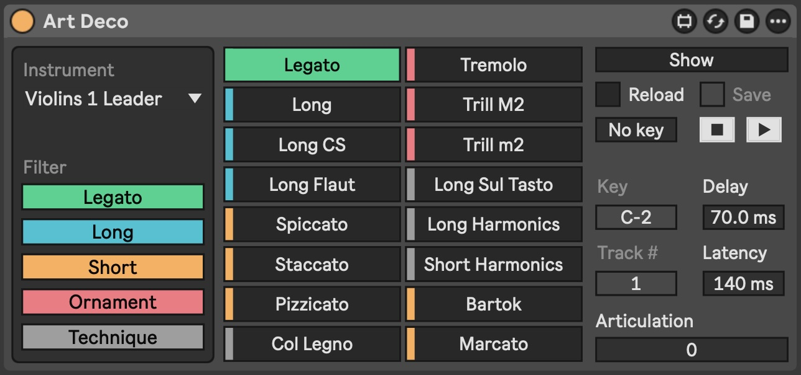

# Art Deco [WIP]

> Articulation delay compensation, a [Max for Live](https://www.ableton.com/en/live/max-for-live/) device for sampled instruments articulation keyswitch automation and delay compensation

_Window_ 
_Device_ 

## Usage

TBD

## Development

### Prerequisites

- configure [maxdiff](https://github.com/Ableton/maxdevtools/tree/main/maxdiff)

### Diff

```bash
git --no-pager diff "./Art Deco.amxd"
```
